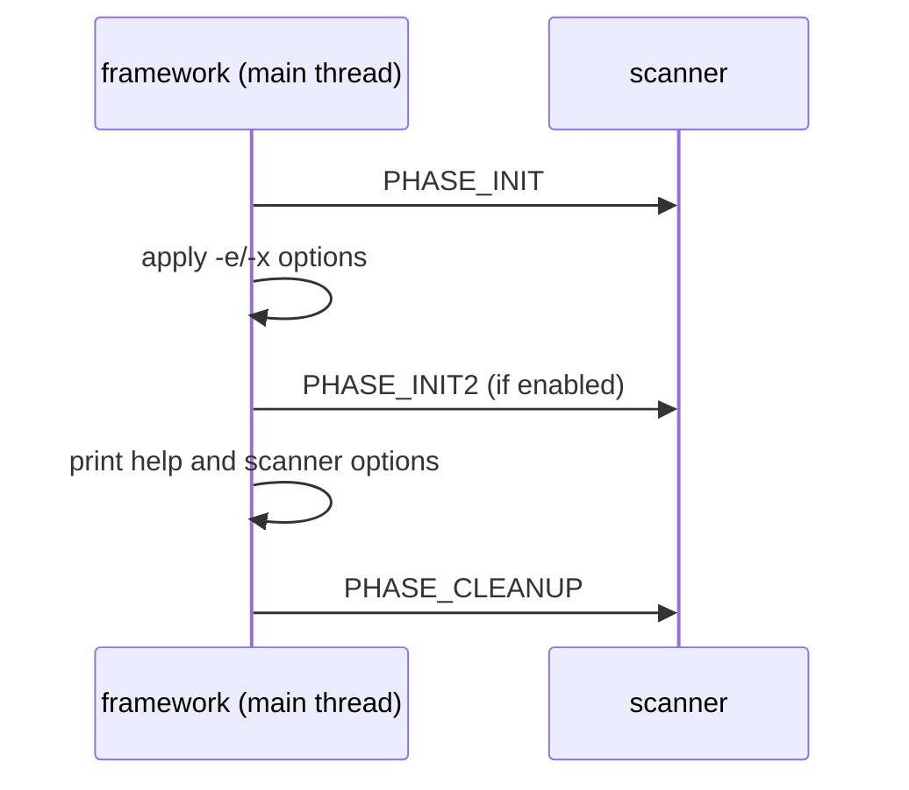
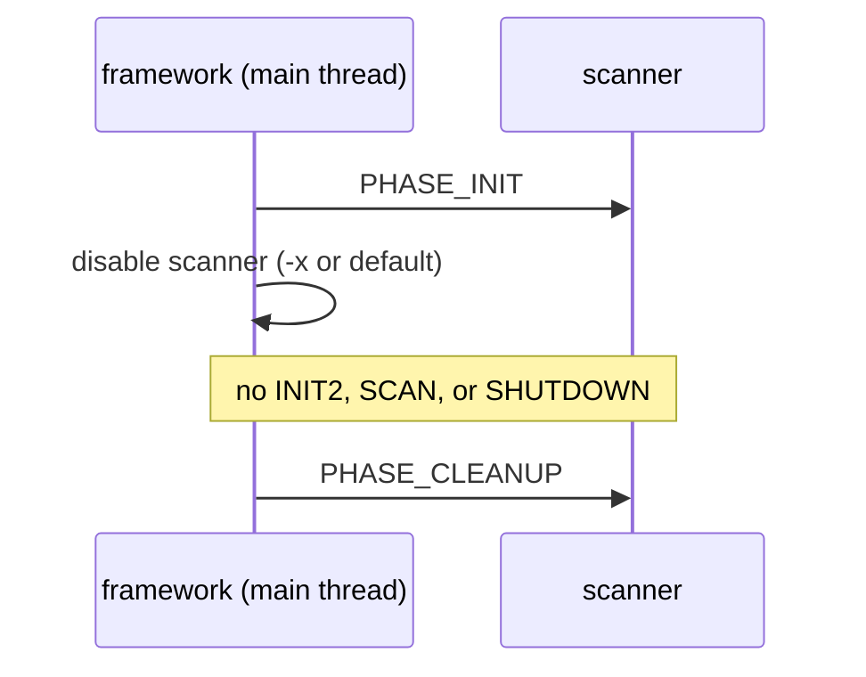
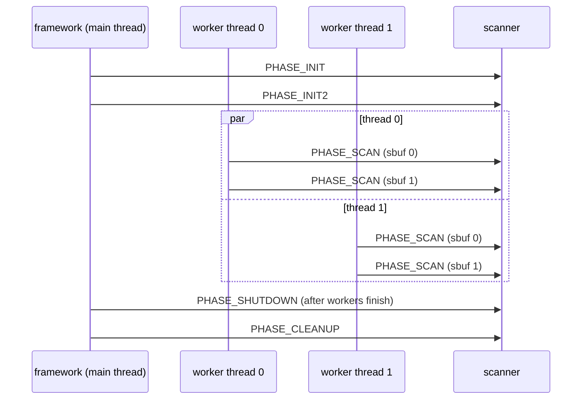
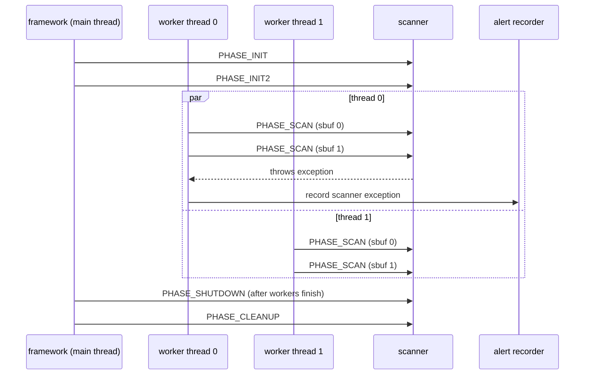

# Scanner API reference

This is the contract for a bulk_extractor 2.x scanner. Read it before changing
a built-in scanner or creating a loadable scanner. The empty loadable-scanner
starting point is [scanner_template.cpp](scanner_template.cpp).

## Lifecycle

| Phase | Called for | Threading | Scanner obligation |
| --- | --- | --- | --- |
| PHASE_INIT | Every loaded scanner | Main thread, serialized | Call sp.check_version(). Fill in sp.info: at minimum use set_name(), then set metadata, flags, limits, feature-recorder definitions, histograms, and -S option help. Do not write output or retain sp. |
| PHASE_INIT2 | Enabled scanners only | Main thread, serialized | Feature recorders now exist. Obtain any recorder with sp.named_feature_recorder() and store the pointer if useful. Do not create feature recorders here. |
| PHASE_ENABLED | No scanner callback | N/A | The framework has applied -e and -x; feature-recorder definitions are frozen. |
| PHASE_SCAN | Enabled scanners, for each eligible sbuf | May run concurrently in multiple worker threads, including concurrent calls to the same scanner | Read sp.sbuf, write findings through a recorder, and call sp.recurse() only when the scanner intentionally exposes derived data. |
| PHASE_SHUTDOWN | Enabled scanners only | Main thread, serialized, after scan work finishes | Finish scanner-owned output that must precede recorder shutdown. Do not expect sp.sbuf. |
| PHASE_CLEANUP | Every loaded scanner, including disabled scanners | Main thread, serialized | Release scanner-owned state. It must be safe after a scanner was disabled and never received INIT2, SCAN, or SHUTDOWN. |

PHASE_INIT is the only phase that may modify sp.info. Feature-recorder
definitions in sp.info->feature_defs and histogram definitions in
sp.info->histogram_defs are read by the framework before PHASE_INIT2.

## Call diagrams

The diagrams show one scanner. `INIT` always occurs when the scanner is
loaded; `CLEANUP` always occurs when the scanner set is destroyed.

### Help (`-h`)

Help does not call `PHASE_SCAN` or `PHASE_SHUTDOWN`.

### Disabled scanner

### Enabled scanner with two worker threads

The calls in the `par` block can overlap, including calls to the same scanner.

### Exception while processing thread 0's second sbuf

`scanner_set::process_sbuf()` catches scanner exceptions. The failed call ends,
but it does not disable the scanner or cancel other worker calls; it records an
alert when available, then the normal shutdown and cleanup sequence follows.

## State and concurrency

A scanner function has no object instance, so scanner-owned state normally
lives in file-static or global objects. Initialize it in PHASE_INIT or
PHASE_INIT2, make access during PHASE_SCAN thread-safe, and release it in
PHASE_CLEANUP.

Treat sp.sbuf as read-only and valid only for the duration of a PHASE_SCAN
callback. Do not retain sp, sp.sbuf, or pointers into its buffer after the
callback returns. feature_recorder::write() and write_buf() are safe for
concurrent scanner calls; protect any other shared scanner state with an
appropriate mutex or atomics.

The framework can bypass a scanner for a small buffer, a duplicate buffer, an
ngram buffer, excessive depth, or scanner flags. A scanner must not assume it
will see every input buffer.

## Feature recorders

Declare a recorder during PHASE_INIT:

~~~
sp.info->feature_defs.emplace_back("example");
~~~

Retrieve it during PHASE_INIT2:

~~~
static feature_recorder *example;
example = &sp.named_feature_recorder("example");
~~~

Then write in PHASE_SCAN:

~~~
example->write_buf(*sp.sbuf, offset, length);
~~~

Do not call named_feature_recorder() before PHASE_INIT2, and do not add
definitions after PHASE_INIT. If a scanner needs no output, it needs no
feature recorder; the template demonstrates that case.

## Loadable scanners

A loadable module is named scan_* and exports this C-linkage factory:

~~~
extern "C" scanner_t *bulk_extractor_scanner_v1();
~~~

The factory returns the scanner function. Build the module against the same
bulk_extractor source version as the executable. The runtime loader discovers
modules in -P and BE_PATH directories; use -P while developing rather than
relying on the current directory.
